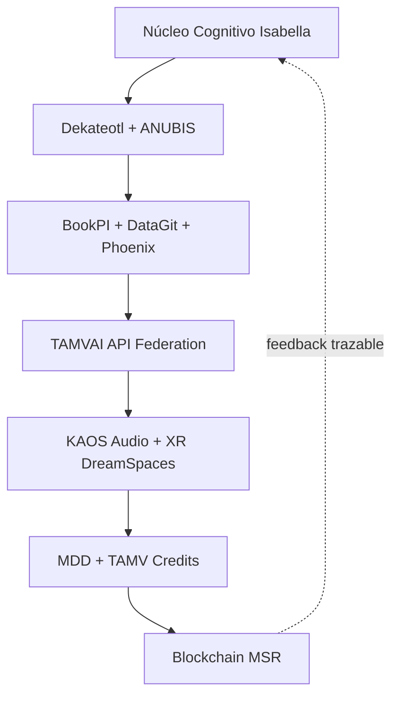

# Isabella IA™ + TAMVAI API NextGen (Blueprint integrado)

## Arquitectura hexagonal federada

## Evoluciones integradas
- Auto-provisioning de agentes: `useAutoAgent()` (diseño de contrato en módulo de filtro).
- Cómputo híbrido: fallback clásico + rutas para simulación cuántica.
- Seguridad: base de auditoría compatible con ZK y anclaje MSR.
- TAMVAI API: preparado para `/v1/filter/ingest` y `/v1/bookpi/append`.
- BookPI Playbook: operación ética + SLOs en `docs/BOOKPI_PLAYBOOK.md`.

## Federados (resumen)
1. Dekateotl: guardrail ético.
2. ANUBIS: sentinel de seguridad.
3. BookPI/DataGit: memoria y evidencia.
4. Phoenix: swarm y crisis mode.
5. MDD/Credits: economía programable.
6. KAOS/XR: capa sensorial adaptativa.
7. MSR: trazabilidad soberana.
